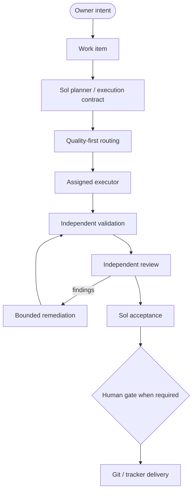
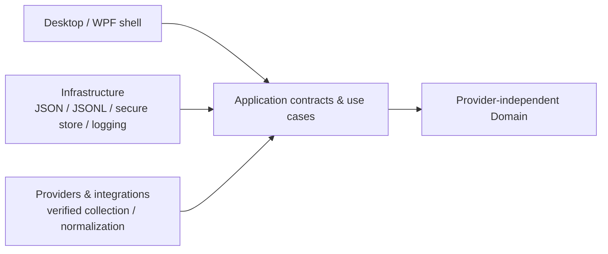

<p align="center">
  
</p>

<h1 align="center">AI Project Orchestrator</h1>

<p align="center">
  Intelligent orchestration for projects, AI agents, execution, and quality.
</p>

<p align="center">
  <a href="https://dotnet.microsoft.com/"></a>
  <a href="https://learn.microsoft.com/dotnet/desktop/wpf/"></a>
  <a href="https://www.microsoft.com/windows/"></a>
  <a href="https://learn.microsoft.com/dotnet/csharp/"></a>
</p>

<p align="center">
  
</p>

> APO is a local-first Windows control center for supervising AI-assisted software delivery. It is being built to coordinate the planner, executor, reviewer, Git/GitHub/Azure Repos, Jira/Azure Boards, validation/CI, and owner approval in one place—without replacing the IDE or those platforms.

## What is AI Project Orchestrator?

AI Project Orchestrator (APO) coordinates the work around software delivery: projects and
repositories, AI capacity, model and agent access, planner-authored execution contracts, bounded
execution, validation, independent review, acceptance, and audit history. The intended experience
lets the owner supervise the handoff between the planner, the bounded executor, the independent
reviewer, source control, work tracking, validation/CI, and the final approval gate.

The product is not an AI chat application and does not replace an IDE, GitHub, Jira, or Azure
DevOps. Its job is to reduce fragile copy/paste handoffs while keeping the owner in charge of
high-risk actions. Quality and risk come before quota savings, and unavailable provider data stays
explicitly unavailable or manual.

## Core capabilities

The product direction brings these capabilities into one supervised workflow:

- :brain: Intelligent, quality-first model and agent routing with quota awareness.
- :bar_chart: AI capacity, subscription, quota, credit, and reset monitoring.
- :file_folder: Project awareness with isolated local workspaces and repository state.
- :robot: AI agent and model registry with truthful connection capabilities.
- :compass: Planner-authored work classification and execution contracts.
- :gear: Bounded, cancellable execution with explicit budgets and stop conditions.
- :test_tube: Validation evidence captured independently from executor claims.
- :mag: Independent review and bounded remediation at configured checkpoints.
- :shield: Human approval gates for high-risk decisions and delivery actions.
- :page_facing_up: Local activity, audit, history, notifications, and reconstructable state.

These are the approved product capabilities, not a claim that every adapter or runtime is already
implemented. See [Current implementation status](#current-implementation-status).

## Orchestration flow

The following is the target product flow. Several stages are still planned and must not be read as
an assertion that the autonomous runtime exists today.



## Current implementation status

APO is an active foundation, not a finished orchestration product.

| Status | Current evidence |
| --- | --- |
| :white_check_mark: Implemented / validated | .NET 10 WPF foundation and resilient empty/no-provider startup shell |
| :white_check_mark: Implemented / validated | JSON documents and monthly JSONL local persistence with safe-write and recovery behavior |
| :white_check_mark: Implemented / validated | Provider-independent quota, subscription, usage, alert, and refresh contracts |
| :white_check_mark: Implemented / validated | Windows Credential Manager adapter with opaque credential references and focused security tests |
| :white_check_mark: Implemented / validated | Self-contained multi-RID publish configuration for `win-x64`, `win-x86`, and `win-arm64` |
| :white_check_mark: Implemented / validated | Project and orchestration storage foundation (APO-27 merged); stores and contracts for projects, agents, routing policies, runs, and review/audit records |
| :white_check_mark: Implemented / validated | Projects workspace (APO-35 merged); project registry list/detail/editor, search/filter, Active/Paused/Blocked/Archived lifecycle state, and truthful local persistence states; APO-36 fixed DI startup regression |
| :white_check_mark: Implemented / validated | APO-37 read-only local Git repository verification with bounded status evidence, cancellation/project isolation, sanitized remotes, and explicit unavailable states |
| :white_check_mark: Implemented / validated | Focused xUnit foundation suite; APO-37 (with SOL-37-01..05 remediation) validation is 70 Desktop tests, 172 Infrastructure tests, and 326 full-suite tests, all passing |
| :white_check_mark: Implemented / validated | Official provider capacity adapter surfaces for Codex, Claude, Kimi, GitHub Copilot, and Antigravity, with documented manual/unsupported boundaries |
| :construction: Planned / bounded future | Local Git evidence is partially implemented through APO-37; provider-independent GitHub/Azure Repos remote evidence (APO-62), Jira/Azure DevOps awareness, and controlled delivery (APO-63) remain unimplemented |
| :construction: Planned | Agent/model registry, quality-first routing, planner contracts, bounded execution, evidence gates, review/remediation, and human approval services |
| :compass: Strategic roadmap | Mission Control, Smart Continue, recovery, dependency-aware work, isolated workspaces, decision ledger, project health, skills, bounded automation, and optional remote approval design |

Not yet implemented: full consumer capacity surfaces beyond the documented adapter boundaries, the
autonomous runtime, routing, tracker automation, remote SCM evidence, controlled remote delivery,
the review/acceptance engines, and the full APO-15 dashboard. The strategic control-plane
capabilities are planned and decomposed in Jira APO-38 through APO-63; they are not shipped by this
repository state. APO-37
verifies a selected registered local path only when the owner clicks Verify repository; it does not
inspect file contents, use credentials, contact a remote service, or perform Git writes. APO does
not fabricate provider numbers or claim CI status before the relevant Story is delivered.

## Smart Continue and integration boundaries

The planned Smart Continue experience lets an owner say `Continue project`. APO would then resolve
the project's durable canonical checkpoint—current work, contract version, dependency state,
selected roles, repository/tracker evidence, validation, review, approval, blockers, and next safe
action—rather than treating old chat history as fresh evidence. It is not implemented in the
current repository state and must require fresh Git, tracker, approval, and validation evidence
when the checkpoint is stale or incomplete.

The roadmap keeps source-control responsibilities distinct:

- **Local Git — APO-37:** implemented read-only verification of a configured local repository and
  its bounded worktree evidence. It performs no remote request and no Git write.
- **Remote SCM evidence — APO-62:** planned provider-independent, read-only evidence from official
  GitHub and Azure Repos integration paths for repository identity, branches/commits, pull requests,
  reviews, checks, and CI/workflow state where exposed.
- **Controlled delivery — APO-63:** planned, separately gated remote write operations bound to exact
  immutable targets, current validation evidence, applicable approval policy, and audit identity.

APO-33 remains the repository-owned GitHub Actions build/test/release Story. A model CLI, missing
remote evidence, or a local branch state must not be presented as proof of remote health, CI
success, synchronization, or delivery completion.

## WPF shell preview

The first branded shell is intentionally a foundation surface: it shows the product identity,
local-first state, and truthful future boundaries without inventing provider data or dashboard
metrics.

<p align="center">
  
</p>

## Architecture

The active architecture is a portable C#/.NET 10 WPF application with clean dependency direction,
JSON/JSONL local persistence, and secure external credential storage. No database engine, ORM,
Node.js runtime, embedded browser, or APO-owned cloud backend is required by V1.



The technical solution and namespaces still use the compatibility-sensitive `AIUsageMonitor` name.
That is deliberate: the product identity has changed, but a large technical rename and LocalAppData
migration require their own planner-approved work.

## AI operating model

APO follows a quality- and risk-first operating policy. Capacity can inform routing, but it never
overrides capability, risk, or the required review gate. These are project roles and target policy;
automated model routing is not implemented yet.

| Model | Default role |
| --- | --- |
| **GPT-5.6 Sol** | Planner, architect, and acceptance authority |
| **GPT-5.6 Luna xHigh** | Substantial implementation and cross-cutting fixes |
| **Claude Sonnet 5** | Exceptional alternative when Luna genuinely needs a difficult independent path |
| **Claude Opus 5** | Periodic independent reviewer at critical checkpoints |
| **GPT-5.6 Terra HIGH** | Optional specialist security review when risk warrants it |
| **Gemini 3.7** | Bounded, repetitive, validation, documentation, or quota-balancing work |

GPT-5.6 Luna xHigh is the primary executor for substantial, bounded, cross-cutting, remediation,
documentation, Git, Jira, and validation work. Execution prompts must be detailed, precise,
bounded, and verification-oriented. Claude Sonnet 5 is exceptional rather than the routine bounded
executor: use it only when Luna genuinely fails on a difficult problem, when an unusually difficult
issue benefits materially from Sonnet, or when Sol explicitly requests an independent alternative.
Claude Opus 5 is used approximately every 5 meaningful implementation prompts and at genuinely
critical checkpoints only, not after every Story. GPT-5.6 Sol remains the Planner, Architect, and
Acceptance Authority. Gemini 3.7 remains auxiliary for suitable bounded or quota-balancing work.

## Security and privacy

- :lock: Windows Credential Manager stores actual credentials outside JSON, JSONL, logs, and source control.
- :key: Application state stores only opaque credential references; raw tokens and passwords are not persisted.
- :no_entry_sign: APO does not extract browser cookies, scrape passwords, or treat a consumer subscription as API entitlement.
- :package: Local-first project state and history remain under per-user application data.
- :scroll: Evidence and audit history are designed to explain routing, validation, review, and approval decisions without storing secrets.
- :shield: High-risk operations stop at explicit human approval gates.

Project isolation, configured exclusions, secret scanning/redaction, least privilege, and visible
destinations are part of the product contract for future integrations.

## Windows compatibility

APO targets Windows 10 version 1809 (build 17763) and Windows 11, with these release RIDs under
consideration:

- `win-x64` - primary development and validation target.
- `win-x86` - configured and compile/publish validated where stated in the evidence.
- `win-arm64` - configured and compile/publish validated where stated; ARM64 hardware execution is not claimed.

The consumer goal is a self-contained Windows application that does not require a separately
installed .NET runtime, SDK, Visual Studio, database engine, Node/npm, embedded browser, or provider
CLI. Claims are limited to the environments and commands actually run.

## Repository structure

```text
AI-Project-Orchestrator/
|-- assets/
|   |-- Logo.png
|   |-- Colors.png
|   |-- runtime/apo-icon.ico
|   `-- readme/apo-flow.svg
|-- docs/
|   |-- BRD.md
|   |-- IMPLEMENTATION_PLAN.md
|   |-- LEGACY_IMPLEMENTATION_MAP.md
|   |-- STRATEGIC_ROADMAP.md
|   `-- SESSION_PROMPTS.md
|-- src/
|   |-- AIUsageMonitor.Desktop/
|   |   `-- Resources/ (WPF brand dictionaries)
|   |-- AIUsageMonitor.Application/
|   |-- AIUsageMonitor.Domain/
|   |-- AIUsageMonitor.Infrastructure/
|   `-- AIUsageMonitor.Providers/
|-- tests/
|   |-- AIUsageMonitor.Domain.Tests/
|   |-- AIUsageMonitor.Provider.Tests/
|   `-- AIUsageMonitor.Infrastructure.Tests/
|-- .ai/CURRENT_STATE.md
|-- AGENTS.md
|-- TASK.md
|-- Directory.Build.props
`-- AIUsageMonitor.sln
```

## Build and test

The commands below use the compatibility-preserved solution name:

```powershell
dotnet restore AIUsageMonitor.sln
dotnet build AIUsageMonitor.sln
dotnet test AIUsageMonitor.sln
```

For a self-contained Windows artifact, use one of the desktop publish profiles:

```powershell
dotnet publish src/AIUsageMonitor.Desktop/AIUsageMonitor.Desktop.csproj `
  -p:PublishProfile=win-x64
```

The matching profiles for `win-x86` and `win-arm64` are in
`src/AIUsageMonitor.Desktop/Properties/PublishProfiles/`. Build, test, and publish output should
be treated as evidence only after the command completes successfully on the current checkout.

## Documentation

- [Business Requirements Document](docs/BRD.md)
- [Implementation Plan](docs/IMPLEMENTATION_PLAN.md)
- [Strategic Orchestration Roadmap](docs/STRATEGIC_ROADMAP.md)
- [Legacy Implementation Map](docs/LEGACY_IMPLEMENTATION_MAP.md)
- [Session Prompt Library](docs/SESSION_PROMPTS.md)
- [Execution Contract and Sol Checkpoint](AGENTS.md)
- [Current State and Validation Handoff](.ai/CURRENT_STATE.md)
- [Current Task Contract](TASK.md)

## Roadmap

The roadmap follows the approved APO Epics and the strategic P0/P1/P2/P3 backlog in Jira. These
are planned capability boundaries, not shipped runtime claims:

1. **P0 control plane — APO-38..43:** agent/model truth, progressive onboarding, contracts, dependency graphs, handoffs, and Smart Continue/recovery.
2. **P0 bounded execution — APO-44..47:** quality-first routing, bounded execution, isolated workspaces, and tracker evidence.
3. **P0 source-control/tracker/evidence — APO-62, APO-48, APO-49, APO-63:** read-only remote SCM/CI evidence, independent QA evidence, human approval policy, and controlled remote delivery.
4. **P0 Mission Control — APO-50:** one evidence-backed command-center read model and surface.
5. **P1 acceleration — APO-51..56:** Review Inbox, composable workflows, project health, decision ledger, runtime evidence, and context budgets.
6. **P2 controlled expansion — APO-57..58:** bounded background housekeeping and optional remote approval security design.
7. **P3 accepted hardening — APO-59..61:** APO-37 evidence bounds, verification UX truthfulness, and explicit real-Git availability semantics.

APO-33 remains the existing CI/release Story under APO-17. Existing APO-27, APO-35, APO-36, and
APO-37 work is implemented evidence, not a claim that the full orchestration runtime exists.

Each Story is scoped by a Sol-approved `TASK.md` contract. A completed foundation does not
authorize the next Story automatically.

## Contributing and governance

APO work is evidence-led and branch-scoped. A contributor or executor should:

1. read `AGENTS.md`, the BRD, current state, implementation plan, and the active `TASK.md`;
2. work only within the assigned Jira Story and preserve unrelated owner changes;
3. validate the relevant build, tests, security, compatibility, and documentation surfaces;
4. update `.ai/CURRENT_STATE.md` with factual evidence and limitations; and
5. stop at the planner boundary so GPT-5.6 Sol can accept, reject, or issue the next contract.

The owner remains the authority for protected-branch merges, high-risk actions, and material
architecture or requirement changes. `TASK.md` is an executable contract, not a historical log.

## Product identity mapping

| Surface | APO identity | Compatibility decision |
| --- | --- | --- |
| User-facing product, shell, README, and metadata | **AI Project Orchestrator (APO)** | Updated in the branding Story |
| Approved visual assets | `assets/Logo.png`, `assets/Colors.png` | Original bytes preserved |
| Runtime icon | `assets/runtime/apo-icon.ico` | Derived compact symbol for Windows surfaces |
| Solution, project, namespace, and test identifiers | `AIUsageMonitor.*` | Preserved for controlled future migration |
| Local persistence root | `%LOCALAPPDATA%\\AIUsageMonitor` | Preserved; no silent data migration |

## License

No license file is currently committed. Until the owner adds a license, reuse and redistribution
rights should not be inferred from this README.

<p align="center">
  
</p>

<p align="center"><sub>AI Project Orchestrator - APO</sub></p>
